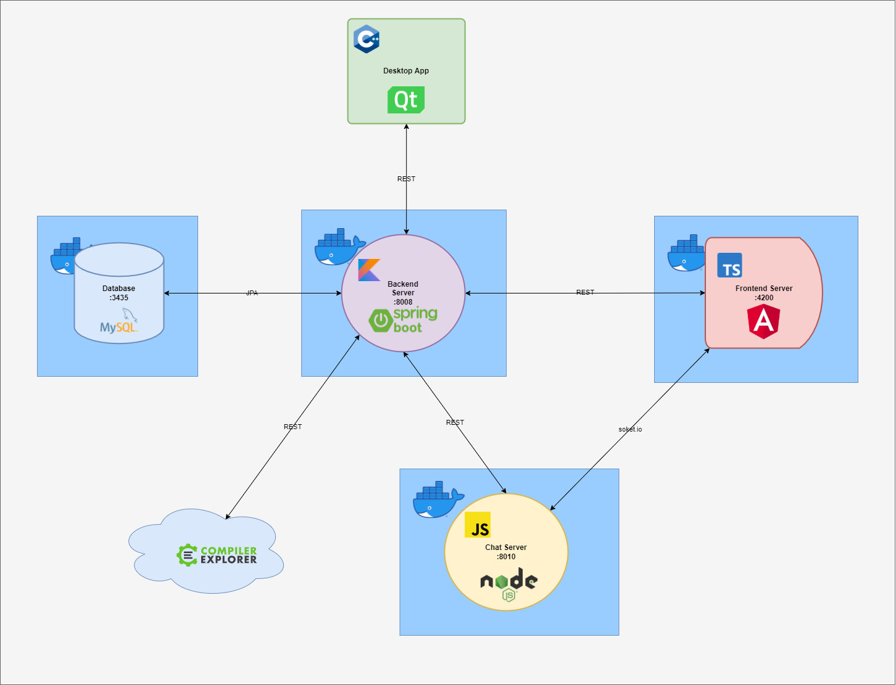

*Like Discord, but you can paste and run code in the chat*
---

# About
This is a Discord clone that allows sending code segments in the chat, as well as executing them with the language of your choice.

# Architecture
The project runs on 3 servers and uses a MySQL database, as well as a desktop C++ application for administration. The main frontend application is written in Angular and served by an Nginx server deployed in Docker.

# Deployment
The project can be deployed to Docker by following the steps [here](docker/README.md).